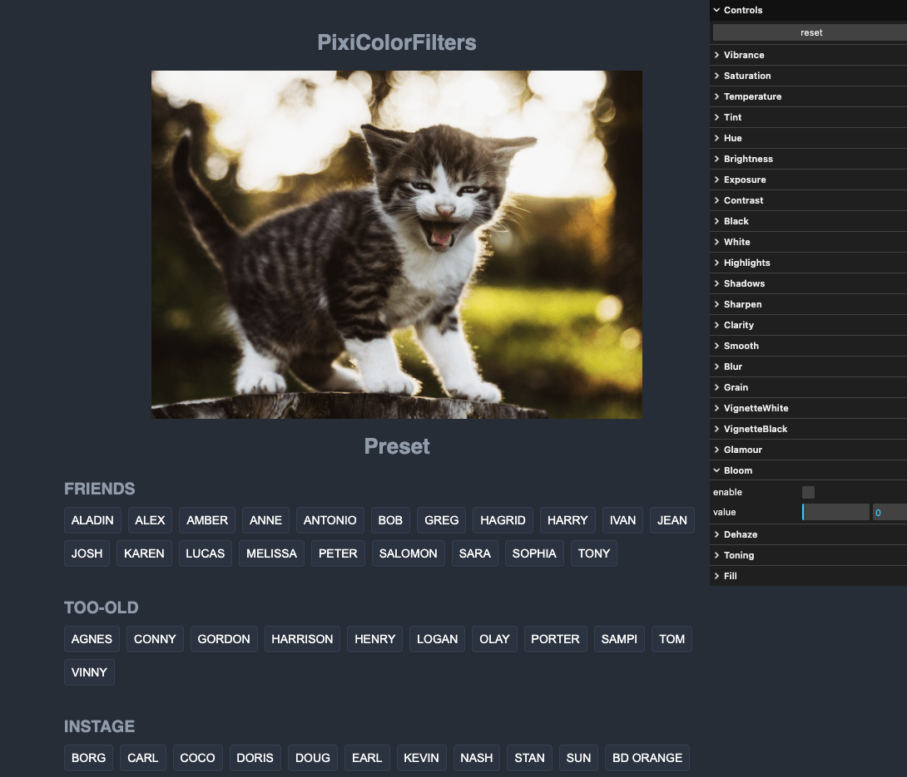

# Pixi Color Effects

A various color Matrix filters for pixi.js with TON of presets!

[DEMO](https://pixicoloreffects.github.io/)



# Install

```shell
# npm
npm install pixi-color-effects

# yarn
yarn add pixi-color-effects
```

# Usage

```typescript
import { Tint } from "pixi-color-effects";

const app = new Application({
  // **
});

let filter = new Tint();
app.stage.filters = [filter];

//  change value
let num = 0;
app.ticker.add((delta) => {
  num += 0.1;
  filter.value = Math.sin(num) * 1;
});
```

## Use Preset

```typescript
import { Preset } from "pixi-color-effects";
let filter = new Preset("aladin");
app.stage.filters = [filter];
```

# License

This project is licensed under the MIT License.
